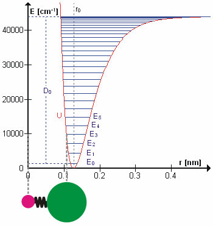
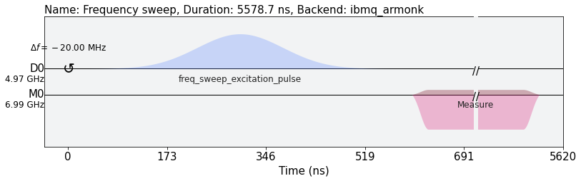
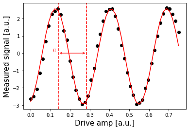
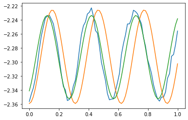
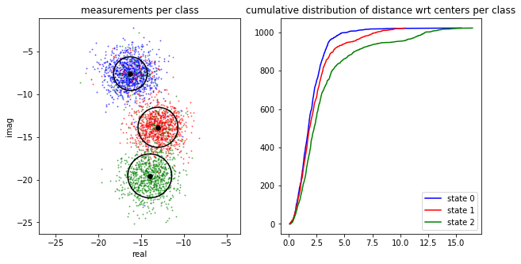

# IBM Q's Challenge Solution Overview

## QuTrits

While the majority of quantum algorithms are based on qbits, 2-level systems with the  and .
The majority of gate operations can be categorized into single-qbit gates, and two-qbits gates; for example, the *Pauli-X* rotates the state  to ; .

As it was pointed in Ref. [1], quantum compting could also be done using multi-level quantum systems (**qudits**) as the building block in quantum information.
Why bother using qudits? It has been theoretically illustrated that qudits can store and processes information more efficienlty than using qubits Ref. [2].
The following natural arising question is how to engeneer qudits?, for example cold molecules in ultra cold temepratures have non-degenerate states  under the present of an external electric field (Stark shift) Ref. [3].
None the less, it will be ideal to desing qudtis taking advantage of the current architectures, for example, superconducting quantum processors.

Qutrits are qudits constructed from quantum states like spin-1 systems, where the basis is 1 and .
In order to have a unviversal quantum computer based on qutris we are required to have a well defined set of gates.
For example, the ***X*** gates are,

And the Hamadard gates are given by,

   

## Calibrating qubits and qutrits and creating single-qutrit gates using Qiskit Pulse

In this project, we make use of Qiskit Pulse to calibrate individual IBM Q's transmon qubits for the first and the second excited states.

The approach is based on a few observations.

1. A transmon qubit can be modelled using a Hamiltonian that describes the Duffing oscillator,

>
>$$
>H = \omega a^\dagger a + \frac{\alpha}{2} >a^\dagger a^\dagger a a,
>$$
>

  where $\omega$ gives the $0\rightarrow1$ excitation frequency ($\omega \equiv \omega^{0\rightarrow1}$) and $\alpha$ is the anharmonicity between the $0\rightarrow1$ and $1\rightarrow2$ frequencies ($\alpha \equiv \omega^{1\rightarrow2} - \omega^{0\rightarrow1}$).

Figure used with permission from Wikipedia

Typical single-qubit calibration and classification experiments are used to extract information about the quantum device, such as oscillator frequencies and amplitudes. This information can be used to construct high-fidelity logical gates, perform error corrections, etc.

2. In the calibration experiment, a series of microwave pulses (frequency sweep) is applied to a qubit in order to determine the qubit frequency, i.e. the difference between the first excited state and the ground state.
This is demonstrated in the figure below.

The calibration experiment can be carried out by creating a Gaussian pulse schedule with fixed duration, sigma and amplitude, and then applying it to a given qubit by varying the frequency within a certain range.
The ($0\rightarrow1$ excitation) frequency of the qubit is determined by measuring the qubit response (absorption rate) after each pulse using a Network Analyzer.

3. Once the frequency of the qubit is calibrated, the next step is to determine the strength of a $\pi$ pulse. The latter chages the qubit state from $\vert0\rangle$ to $\vert1\rangle$, and vice versa. This is also called the $X$ or $X180$ gate, or bit-flip operator.
A technique called Rabi experiment is used to calibrate the amplitude needed to achieve a $\pi$ rotation from $\vert0\rangle$ to $\vert1\rangle$. The desired rotation is shown on the Bloch sphere in the figure below -- you can see that the $\pi$ pulse gets its name from the angle it sweeps over on a Bloch sphere.

In the Rabi experiment, a Gaussian pulse schedule is created with fixed duration, sigma and frequency that was obtained in the previous experiment, and the amplitude is changed in small increments. The qubit response is then measured after each pulse to determine the optimal amplitude.

4. Similar technique can be used to calibrate and measure the second excited state.
However, due to hardware limitations we cannot apply a strong enough pulse in order to excite the transmon from the ground state to the second excited state directly.
We use the above technique to take the qubit to the first excited state first, and then apply a sideband frequency sweep to find and calibrate the frequency and amplitude needed to take the transmon to the second excited state.

5. Once our $\pi$ pulses have been calibrated, we can now create the states $\vert1\rangle$ and $\vert2\rangle$ with good probability.
We can use this to find out what the states $\vert0\rangle$, $\vert1\rangle$ and $\vert2\rangle$ look like in our measurements, by repeatedly preparing them and plotting the measured signal.
The results of the measurements are used to build a discriminator, which is a function which takes a measured and kerneled complex value and classifies it as 0, 1 or 2.

## Implementing Single-qutrit Gates

We then used the results form the experiments to construct and test single-qutrit gates on IBM Q's ibmq_armonk backend:

1. $X^(01)$ gate

> The $X^(01)$ gate flips qutrit from $|0\rangle$ state to $|1\rangle$ state and vice versa.
>

2. $X^(12)$ gate

> The $X^(12)$ gate flips qutrit from $|1\rangle$ state to $|2\rangle$ state and vice versa.
>

3. $X^(02)$  gate

> The $X^(02)$ gate flips qutrit from $|0\rangle$ state to $|2\rangle$ state and vice versa.
>

4. Hadamard $H^(01)$ gate

> The $H^(01)$ gate takes qutrit from $|0\rangle$ state to a superposition of $|0\rangle$ and $|1\rangle$:
>
> $\sqrt{\frac{1}{2}}*(|0\rangle + |1\rangle)$
>

5. Hadamard $H^(02)$ gate

> The $H^(02)$ gate takes qutrit from $|0\rangle$ state to a superposition of $|0\rangle$ and $|2\rangle$:
>
> $\sqrt{\frac{1}{2}}*(|0\rangle + |2\rangle)$
>

6. Hadamard $H^(12)$ gate

> The $H^(12)$ gate takes qutrit from $|0\rangle$ state to a superposition of $|1\rangle$ and $|2\rangle$:
>
> $\sqrt{\frac{1}{2}}*(|1\rangle + |2\rangle)$
>

## Executing on IBM Q Backend

We implemented the above experiments using Qiskit Pulse and executed them on the IBM Q's [ibmq_armonk](https://quantum-computing.ibm.com/services?services=systems) backend.

## Python Code and Jupyter Notebooks

Python code using Qiskit Pulse can be found in the [/ibmq](ibmq) subfolder.

Please review the implementation of the above calibration technique and single-qutrit gates in the attached [ibmq/Gates Jupyter notebook](ibmq/class_gates.ipynb).

The [ibmq/Presentation jupyter notebook](ibmq/Presentation.ipynb) provides a summary and some additional examples.

## References and Further Reading

1. [Front. Phys. **8**, 479 (2019)](www.frontiersin.org/articles/10.3389/fphy.2020.589504/full).
2. [Adv. Quantum Technol. **3**,  1900074 (2020)(https://onlinelibrary.wiley.com/doi/10.1002/qute.201900074)
3. R. V. Krems, Molecules in Electromagnetic Fields: from Ultracold Physics to Controlled Chemistry, Wiley (2018).
4. T. Alexander, N. Kanazawa, D.J. Egger, L. Capelluto, C.J. Wood, A. Javadi-Abhari, D.C.McKay, [Qiskit pulse: programming quantum computers through the cloud with pulses](https://iopscience.iop.org/article/10.1088/2058-9565/aba404)
5. Y. Wang, Z. Hu, B.C. Sanders, S. Kais, [Qudits and High-Dimensional Quantum Computing](https://www.frontiersin.org/articles/10.3389/fphy.2020.589504/full)
6. P. Niemann, R.Wille, R. Drechsler, [Equivalence Checking in Multi-level Quantum Systems](http://www.informatik.uni-bremen.de/agra/doc/konf/14_rc_equivalence_checking_multi-level_quantum_systems.pdf)
7. E.O. Kiktenko, A.K. Fedorov, O.V.Man’ko, V.I.Man’ko, [Multilevel superconducting circuits as two-qubit systems: Operations, state preparation, and entropic inequalities](https://arxiv.org/pdf/1411.0157.pdf)

[Back to README](README.md)
