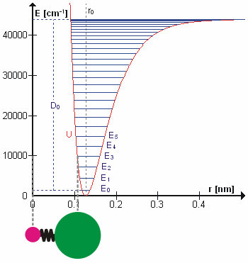
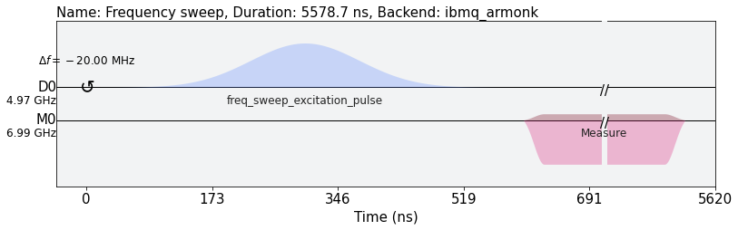
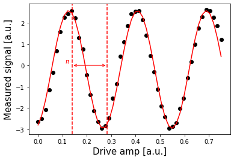
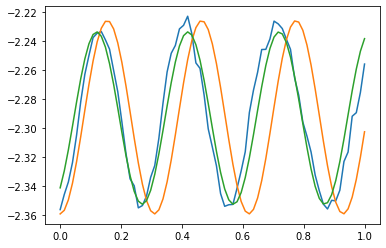
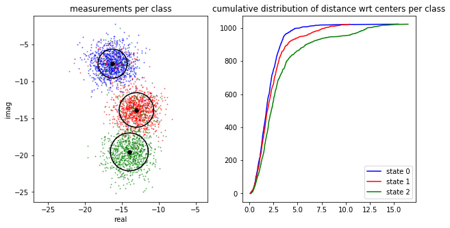
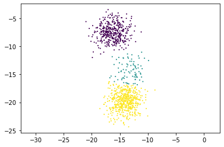
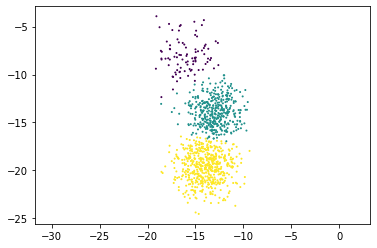
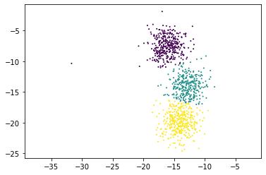

# IBM Q's Challenge Solution Overview

## Qutrits

The majority of existing quantum algorithms are based on qubits, 2-level systems with the  and .
Corresponding gate operations can be composed from single-qubit gates, and two-qubits gates; for example, the *Pauli-X* rotates the state  to ; .

As it was pointed out in Ref. [1], quantum computing could also be done using multi-level quantum systems (**qudits**) as the building block in quantum information.
Why bother using qudits? It has been theoretically illustrated (Ref. [2]) that qudits-based quantum systems can store and processes information more efficiently than those using only qubits.
A natural question arises, how to engineer qudits?. For example, cold molecules in ultra cold temperatures have non-degenerate states  under the presence of an external electric field (Stark shift), Ref. [3].
Nonetheless, it would be ideal to design qudits taking advantage of the current architectures, for example, superconducting quantum processors.

Qutrits are qudits that are constructed from quantum states like spin-1 systems, where the basis is  and .
In order to have a universal quantum computer based on qutris, we need to have a well defined set of gates.
For example, the ***X*** gates are,

>
>
>

and the Hadamard gates are given by,

>
>   
>

## Calibrating qubits and qutrits and creating single-qutrit gates using Qiskit Pulse

In this project, we make use of Qiskit Pulse to calibrate individual IBM Q's transmon qubits for the first and the second excited states.

The approach is based on a few observations.

1. A transmon qubit can be modelled using a Hamiltonian that describes the Duffing oscillator,

>
>
>

  where  gives the  excitation frequency () and  is the anharmonicity between the  and  frequencies ().



Figure used with permission from Wikipedia

Typical single-qubit calibration and classification experiments are used to extract information about the quantum device, such as oscillator frequencies and amplitudes. This information can be used to construct high-fidelity logical gates, perform error corrections, etc.

2. In the calibration experiment, a series of microwave pulses (frequency sweep) is applied to a qubit in order to determine the qubit frequency, i.e. the difference between the first excited state and the ground state.

The calibration experiment can be carried out by creating a Gaussian pulse schedule with fixed duration, sigma and amplitude, and then applying it to a given qubit by varying the frequency within a certain range.
The ( excitation) frequency of the qubit is determined by measuring the qubit response (absorption rate) after each pulse using a Network Analyzer.

This is demonstrated in the figure below.



3. Once the frequency of the qubit is calibrated, the next step is to determine the strength of a  pulse. The latter chages the qubit state from  to , and vice versa. This is also called the  or  gate, or bit-flip operator.
A technique called Rabi experiment is used to calibrate the amplitude needed to achieve a  rotation from  to . The desired rotation is shown on the Bloch sphere in the figure below - you can see that the  pulse gets its name from the angle it sweeps over on a Bloch sphere.


In the Rabi experiment, a Gaussian pulse schedule is created with fixed duration, sigma and frequency (that was obtained in the previous experiment), and the amplitude is changed in small increments. The qubit response is then measured after each pulse to determine the optimal amplitude.



4. Similar technique can be used to calibrate and measure the second excited state.
However, due to hardware limitations we cannot apply a strong enough pulse in order to excite the transmon from the ground state to the second excited state directly.
We use the above technique to take the qubit to the first excited state first, and then apply a sideband frequency sweep to find and calibrate the frequency and amplitude needed to take the transmon to the second excited state.



5. Once our  pulses have been calibrated, we can now create the states  and  with good probability.
We can use this to find out what the states ,  and  look like in our measurements, by repeatedly preparing them and plotting the measured signal.
The results of the measurements are used to build a discriminator, which is a function which takes a measured and kerneled complex value and classifies it as 0, 1 or 2.



## Executing on IBM Q Backend

We implemented the above experiments using Qiskit Pulse, and executed them on the IBM Q's [ibmq_armonk](https://quantum-computing.ibm.com/services?services=systems) backend.

## Implementing Single-Qutrit Gates

We then used the results from the experiments to construct and test single-qutrit gates on IBM Q's *ibmq_armonk* backend. Below are some examples.

1. ** gate**

The  gate takes qutrit from  state to  state and vice versa:

> 

The gate is constructed by sending a Gaussian pulse with the ( excitation) qubit frequency to the qubit's Drive Channel:
```
pulse.play(cal.pulse_rx01(), pulse.DriveChannel(qbit)) #x
```

2. ** gate**

The  gate takes qutrit from  state to  state and vice versa:

> 

The gate is constructed by sending a Gaussian pulse with the ( excitation) qubit frequency to the qubit's Drive Channel:
```
pulse.play(cal.pulse_rx12(), pulse.DriveChannel(qbit)) #x
```

3. ** gate**

The  is similar to the  gate, except it adds a phase shift.

The gate is constructed by sending three Gaussian pulses with the (( excitation)) qubit frequency to the qubit's Drive Channel, first with half-amplitude, then the optimal amplitude, then half-amplitude again:
```
yrot_pulse =cal.gaussian_pulse(drive_power=drive_power/2)
pulse.shift_frequency(cal.df01_calib, pulse.DriveChannel(qbit)) #0=>1 freq
pulse.play(yrot_pulse, pulse.DriveChannel(qbit)) #sqrt(y)
pulse.play(cal.pulse_rx01(), pulse.DriveChannel(qbit)) #x
pulse.play(yrot_pulse, pulse.DriveChannel(qbit)) #sqrt(y)
```

The measurement results from running the  pulse schedule on the *ibmq_armonk* qubit are plotted below. They demonstrate a high fidelity of the gate.


4. **Hadamard  gate**

The  gate takes qutrit from  state to a superposition of  and :

> 

The gate is constructed by sending two Gaussian pulses with different frequencies to the qubit's Drive Channel, the first one with  and the second one with :
```
pulse.shift_frequency(cal.df01_calib, pulse.DriveChannel(qbit))
pulse.play(cal.pulse_rx01(theta = np.pi/2), pulse.DriveChannel(qbit)) # PI/2
pulse.shift_frequency(cal.df12_calib, pulse.DriveChannel(qbit))
pulse.play(cal.pulse_rx12(), pulse.DriveChannel(qbit)) # PI
```
The measurement results from running the  pulse schedule on the *ibmq_armonk* qubit are plotted below.



5. **Hadamard  gate**

The  gate takes qutrit from  state to a superposition of  and :

> 

The gate pulse schedule is similar to that of the  gate, except the first pulse is sent with  and the second one with :
```
pulse.shift_frequency(cal.df01_calib, pulse.DriveChannel(qbit))
pulse.play(cal.pulse_rx01(), pulse.DriveChannel(qbit)) # PI
pulse.shift_frequency(cal.df12_calib, pulse.DriveChannel(qbit))
pulse.play(cal.pulse_rx12(theta = np.pi/2), pulse.DriveChannel(qbit)) # PI/2
```
The measurement results from running the  pulse schedule on the *ibmq_armonk* qubit are plotted below.



6. **Equal superposition**

Finally, we constructed and tested a custom gate that takes qutrit from  state to a superposition of all three states, ,  and .
The gate is constructed by sending two Gaussian pulses with different frequencies and different  to the qubit's Drive Channel:
```
theta1 = 2*np.cos(1/np.sqrt(3))
theta2 = np.pi/2
pulse.shift_frequency(cal.df01_calib, pulse.DriveChannel(qbit))
pulse.play(cal.pulse_rx01(theta = theta1), pulse.DriveChannel(qbit))
pulse.shift_frequency(cal.df12_calib, pulse.DriveChannel(qbit))
pulse.play(cal.pulse_rx12(theta = theta2), pulse.DriveChannel(qbit))
```
The measurement results from running the above pulse schedule on the *ibmq_armonk* qubit are plotted below.




## Python Code and Jupyter Notebooks

The Python code using Qiskit Pulse can be found in the [ibmq](ibmq) subfolder.

Please review the implementation of the above calibration technique and single-qutrit gates in the [ibmq/class_gates Jupyter notebook](ibmq/class_gates.ipynb).

## References and Further Reading

1. [Front. Phys. **8**, 479 (2019)](www.frontiersin.org/articles/10.3389/fphy.2020.589504/full).
2. [Adv. Quantum Technol. **3**,  1900074 (2020)(https://onlinelibrary.wiley.com/doi/10.1002/qute.201900074)
3. R. V. Krems, Molecules in Electromagnetic Fields: from Ultracold Physics to Controlled Chemistry, Wiley (2018).
4. T. Alexander, N. Kanazawa, D.J. Egger, L. Capelluto, C.J. Wood, A. Javadi-Abhari, D.C.McKay, [Qiskit pulse: programming quantum computers through the cloud with pulses](https://iopscience.iop.org/article/10.1088/2058-9565/aba404)
5. Y. Wang, Z. Hu, B.C. Sanders, S. Kais, [Qudits and High-Dimensional Quantum Computing](https://www.frontiersin.org/articles/10.3389/fphy.2020.589504/full)
6. P. Niemann, R.Wille, R. Drechsler, [Equivalence Checking in Multi-level Quantum Systems](http://www.informatik.uni-bremen.de/agra/doc/konf/14_rc_equivalence_checking_multi-level_quantum_systems.pdf)
7. E.O. Kiktenko, A.K. Fedorov, O.V.Man’ko, V.I.Man’ko, [Multilevel superconducting circuits as two-qubit systems: Operations, state preparation, and entropic inequalities](https://arxiv.org/pdf/1411.0157.pdf)

[Back to README](README.md)
