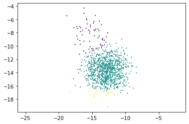

# IBM Q's Challenge Solution Overview

## Qutrits

Most of the existing quantum algorithms are based on qubits, 2-level systems with two states the **|0>** being the ground state and **|1>** being the first excited state. Gate operations can be composed from single-qubit gates, and two-qubits gates; for example, the Pauli **X** gate rotates the state |1> to |0> and vice versa.

As it was pointed out in numerous references, including Ref. [1], quantum computing could also be done using multi-level quantum systems, called **qudits**, as the building block in quantum information.
Why bother using qudits? It has been theoretically illustrated (Ref. [2]) that qudits-based quantum systems can store and processes information more efficiently than those using only qubits.
A natural question arises, how to engineer qudits? For example, cold molecules in ultra cold temperatures have non-degenerate states  under the presence of an external electric field (Stark shift), Ref. [3].
Nonetheless, it would be ideal to design qudits taking advantage of the current architectures, for example, superconducting quantum processors.

Qutrits are qudits based on three states: ground **|0>**, first excited **|1>**, and second excited **|2>**. In order to have a universal quantum computer based on qutrits, we need to implement set of gates. We illustrate below ideal qutrits gates
 ***X*** gates :

>
>
>

***H*** Hadamard gates:

>
>   
>

## Calibrating qubits and qutrits and creating single-qutrit gates using Qiskit Pulse

In this project, we make use of the python library Qiskit Pulse to calibrate individual IBM Q's transmon qubits for the first and the second excited states.

### the transmon

A transmon qubit can be modelled using a Hamiltonian that describes the Duffing oscillator :

>
>
>

  where  gives the  excitation frequency () and  is the anharmonicity between the  and  frequencies ().


*Figure used with permission from (c) Wikipedia*

Typical single-qubit calibration and classification experiments are used to derive information about the quantum device, such as oscillator frequencies and amplitudes. This information can be used to construct high-fidelity logical gates, perform error corrections, etc.

### calibration types
In the calibration experiment, for the pulse two values have to be calibrated : the frequency (should be the resonance frequency of the qbit) and the amplitude (shall correspond to a rotation of \pi). 

#### Frequency calibration
For the frequency a series of microwave pulses with a fixed enveloppe but with varying frequency. This frequency sweep is specific to a state transition frequency, i.e. the difference between the first excited state and the ground state.
The calibration experiment can be carried out by creating a Gaussian pulse schedule with fixed duration, sigma and amplitude, and then applying it to a given qubit by varying the frequency within a certain range. The response is analysed and the amplitude peak corresponds to the target frequency.


N.B. We chose Gaussian pulse but other pulses can be used, such as the the Drag pulse.

#### Amplitude calibration : Rabi Procedure
Once the frequency is calibrated, the next step is to determine the amplitude of pulse corresponding to a rotation of . This Pulse is effectively an X gate turning |0> into |1> and |1> into |0> as illustrated below :


In the Rabi experiment, the same Gaussian pulse as before is usef, but with fixed already calibrated frequency and a varying amplitude. The state response is then measured after each pulse to determine the optimal amplitude which correspond to half a cycle of the response as illustrated below.


### State transition calibration procedure

#### |0>-|1> Calibration 
The first step is to find the F01 frequency. IBMQ backend gives us a default one but it is possible to improve it. We define a gaussian pulse as described the frequency calibration procedure, and measure it, yielding the following schedule :


Once the frequency F01 is found, we proceed with the amplitude calibration and get the parameter A01. This gives us a calibrated pulse, corresponding the X01 gate :

**P01 = Gauss(A01,F01)**

#### |1>-|2> Calibration

To perform this calibration we proceed exactly as before, but first take the ground state **|0>** to the excited state **|1>**. We find the optimal pulse to transition between **|2>** and **|1>** : 

**P12 = Gauss(A12,F12)**

### Measurement calibration

Once our  pulses have been calibrated, we can now drive the system to the all 3 states. We conduct three experiments : exp0 is just a measurement, exp1 is P01 then a measurement, exp2 is P01 then P12 then a measurement. Ideally these experiments would yield the resulting states **|0>**, **|1>** and **|2>** respectively.

The results of the measurements are used to implement a discriminator, in our case we simply classify the measuremments as the closest calibrated center. In the below plot on the left the distribution of the measurements are displayed. The color corresponds to the id of the experiment (0,1 or 2). In an ideal world the colors would be totally separable, but the noise prevents us to have a perfect system.


The output of this calibration is calibrated state centers and function able to assign each measurement to a state.

## Executing and Testing on IBM Q Backend

We implemented the above experiments using Qiskit Pulse, and executed them on the IBM Q's [ibmq_armonk](https://quantum-computing.ibm.com/services?services=systems) backend.

## Implementing Single-Qutrit Gates

We then used the results from the experiments to construct and test single-qutrit gates on IBM Q's *ibmq_armonk* backend. Below are some examples.

** gate**

The  gate takes qutrit from  state to  state and vice versa:

> 

The gate is constructed by sending a Gaussian pulse with the ( excitation) qubit frequency to the qubit's Drive Channel:
```
pulse.play(cal.pulse_rx01(), pulse.DriveChannel(qbit)) #x
```

** gate**

The  gate takes qutrit from  state to  state and vice versa:

> 

The gate is constructed by sending a Gaussian pulse with the ( excitation) qubit frequency to the qubit's Drive Channel:
```
pulse.play(cal.pulse_rx12(), pulse.DriveChannel(qbit)) #x
```

** gate**

The  is based on the **P01** pulse, except the amplitude is divided by 1 and made imaginary.

We demonstrate a working **SY01** gate with the following circuit **SY01 X SY01**.
```
yrot_pulse =cal.gaussian_pulse(drive_power=drive_power/2)
pulse.shift_frequency(cal.df01_calib, pulse.DriveChannel(qbit)) #0=>1 freq
pulse.play(yrot_pulse, pulse.DriveChannel(qbit)) #sqrt(y)
pulse.play(cal.pulse_rx01(), pulse.DriveChannel(qbit)) #x
pulse.play(yrot_pulse, pulse.DriveChannel(qbit)) #sqrt(y)
```

The measurement results from running the  testing pulse schedule on the *ibmq_armonk* qubit are plotted below. Most of the measurements are gathered around the **|1>** state, which is what we expected.




4. **Hadamard  gate**

The  gate takes qutrit from  state to a superposition of  and :

> 

The gate is constructed by sending two Gaussian pulses with different frequencies to the qubit's Drive Channel, the first one with  and the second one with :
```
pulse.shift_frequency(cal.df01_calib, pulse.DriveChannel(qbit))
pulse.play(cal.pulse_rx01(theta = np.pi/2), pulse.DriveChannel(qbit)) # PI/2
pulse.shift_frequency(cal.df12_calib, pulse.DriveChannel(qbit))
pulse.play(cal.pulse_rx12(), pulse.DriveChannel(qbit)) # PI
```
We demontsrate this gate by creating an equa superposition of **|0>** and **|2|>** The measurement results from running the  pulse schedule on the *ibmq_armonk* qubit are plotted below.


5. **Hadamard  gate**

The  gate takes qutrit from  state to a superposition of  and :

> 

The gate pulse schedule is similar to that of the  gate, except the first pulse is sent with  and the second one with :
```
pulse.shift_frequency(cal.df01_calib, pulse.DriveChannel(qbit))
pulse.play(cal.pulse_rx01(), pulse.DriveChannel(qbit)) # PI
pulse.shift_frequency(cal.df12_calib, pulse.DriveChannel(qbit))
pulse.play(cal.pulse_rx12(theta = np.pi/2), pulse.DriveChannel(qbit)) # PI/2
```
The measurement results from running the  pulse schedule on the *ibmq_armonk* qubit are plotted below.


6. **Equal superposition  **

Finally, we constructed and tested a custom gate that takes qutrit from  state to a superposition of all three states, ,  and .
The gate is constructed by sending two Gaussian pulses with different frequencies and different  to the qubit's Drive Channel:
```
theta1 = 2*np.cos(1/np.sqrt(3))
theta2 = np.pi/2
pulse.shift_frequency(cal.df01_calib, pulse.DriveChannel(qbit))
pulse.play(cal.pulse_rx01(theta = theta1), pulse.DriveChannel(qbit))
pulse.shift_frequency(cal.df12_calib, pulse.DriveChannel(qbit))
pulse.play(cal.pulse_rx12(theta = theta2), pulse.DriveChannel(qbit))
```
The measurement results from running the above pulse schedule on the *ibmq_armonk* qubit are plotted below.


## Python Code and Jupyter Notebooks

The Python code using Qiskit Pulse can be found in the [ibmq](ibmq) subfolder.

Please review the implementation of the above calibration technique and single-qutrit gates in the [ibmq/class_gates Jupyter notebook](ibmq/class_gates.ipynb).

## References and Further Reading

1. [Front. Phys. **8**, 479 (2019)](www.frontiersin.org/articles/10.3389/fphy.2020.589504/full).
2. [Adv. Quantum Technol. **3**,  1900074 (2020)(https://onlinelibrary.wiley.com/doi/10.1002/qute.201900074)
3. R. V. Krems, Molecules in Electromagnetic Fields: from Ultracold Physics to Controlled Chemistry, Wiley (2018).
4. T. Alexander, N. Kanazawa, D.J. Egger, L. Capelluto, C.J. Wood, A. Javadi-Abhari, D.C.McKay, [Qiskit pulse: programming quantum computers through the cloud with pulses](https://iopscience.iop.org/article/10.1088/2058-9565/aba404)
5. Y. Wang, Z. Hu, B.C. Sanders, S. Kais, [Qudits and High-Dimensional Quantum Computing](https://www.frontiersin.org/articles/10.3389/fphy.2020.589504/full)
6. P. Niemann, R.Wille, R. Drechsler, [Equivalence Checking in Multi-level Quantum Systems](http://www.informatik.uni-bremen.de/agra/doc/konf/14_rc_equivalence_checking_multi-level_quantum_systems.pdf)
7. E.O. Kiktenko, A.K. Fedorov, O.V.Man’ko, V.I.Man’ko, [Multilevel superconducting circuits as two-qubit systems: Operations, state preparation, and entropic inequalities](https://arxiv.org/pdf/1411.0157.pdf)

[Back to README](README.md)
