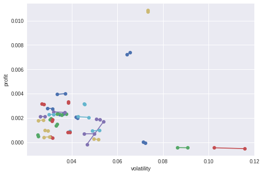
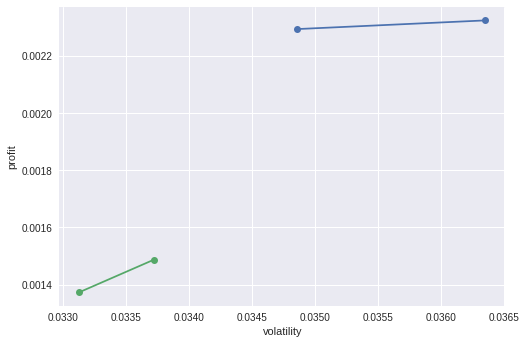
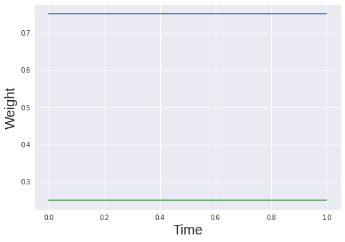
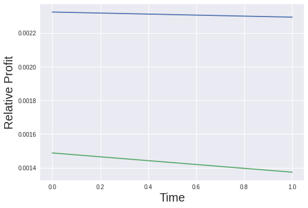
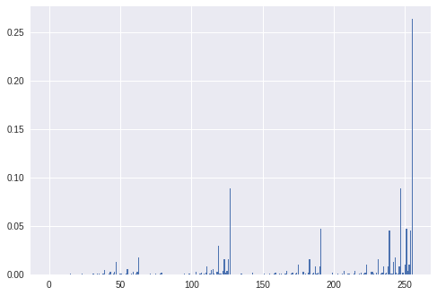
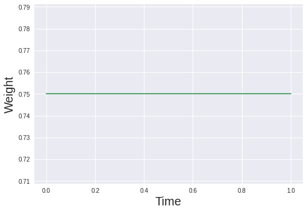

# Xanadu's Challenge Solution Overview

# Introduction

In this project we are going to solve the Financial Portfolio Optimization problem using qutrits. Portfolio Optimization is the process of choosing the best portfolio out of the set of all portfolios being considered according to some measure like Expected Return or Minimization of Risk. This objective is central in the job of a professional asset manager no matter which financial institution they are working in. For instance, a head of investments in a pension fund, wants to compose their portfolio out of financial instruments that provide stable, low risk returns, so the investors into the pension fund can enjoy a safe financial future. Conversely, a Chief Investment Officer of a hedge fund aims to maximize their quarterly return and maximize their alpha (performance of the fund compared to the benchmark index).  

Financial Optimization problem is a popular topic among people interested in solving Optimization problems on the Quantum Computers. During our time at the Creative Destruction Lab we had pleasure of meeting Román Orús of the Multiverse Computing. He and his company have produces a crucial paper on the topic called "Quantum Portfolio Optimization with Investment Bands and Target Volatility"[1], which provides a technical introduction to the topic. One of the most important results of the paper is the derivation of the Hamiltonian: 

> %5E%7B2%7D)

When we are picking stocks for our portfolio we have to consider both the asset itself and the time. Effectively, this means that even for one stock we need to consider 365 points. Naturally, when we want to track more companies for a longer time, size of the data for monitoring increases dramatically. This increase in required data makes it computationally expensive to consider an extremely large collection of assets. According to The World Bank there are approximately 43,000 listed companies on the planet [2], if we try monitoring all of them for a year we need to track roughly 16 million data points. For a general discrete probability distribution of n points, we need on classical computer `2 ^ (16 * n)` bits of memory assuming the single precision requirements, a quantum computer made of qubits would need only `16 * n` qubits (from the representational point of view). Amazingly, with a qutrit system we would only need `16 * n / 1.585)` qutrits of memory. In other words n qutrits could represent `1.5 ^ n` times more information than `n` qubits. We can clearly see then that a qutrit quantum computer is perfectly suited for portfolio optimization problem. 

## Technical Description

We chose two very interesting periods of time as our data: 2008 Financial Crisis and 2020 COVID Pandemic. These two periods represent an atypical activity in the global financial markets and our portfolio consisted of 34 assets from every major industry. Our challenge is to choose the best assets from the data by leveraging inherent advantages of the qutrits. The [Dataloader](https://github.com/olegxtend/Hackathon2021/blob/main/CosmiQ/xanadu/dataloader_class.py) has prepared our data for DMRG, PennyLane and Strawberry Fields. Interestingly enough, Netflix was the least volatile asset in 2008.

## Building a Problem Hamiltonian for the Qutrit Gate

In our Hamiltonian we have chosen to use parameters `t` for time, `i` for assets and `q` for the number of precision qubits. 

## Using PennyLane QAOA and Strawberry Fields QAOA to solve the Financial Portfolio Optimization Problem

## Using DMRG to solve the Financial Portfolio Optimization Problem

## Business Proposal

In our work we have proposed a solution to the well known optimization problem using the most recent development in the field of quantum computing. The business potential for this technology is extraordinary in the field of finance. Qutrits have the ability to represent `1.5 ^ n` times more information than `n` qubits, which will be a crucial difference maker for the portfolio optimization. Currently, the price for running a single task on the quantum computer is around 30 cents. While this might not seem like a lot, we need to understand that if an entire department is using a quantum computer to calculate complex simulations the costs increase exponentially. 

In 2019, Top ten asset managers have more than 30 trillion assets under management[1] and are in a continuous competition with each other to increase their market share. While quantum computing for finance is still in the nascent stages of development, there is an strong interest on behalf of the asset managers in quantum technologies. For instance, companies like J.P. Morgan Chase & Co. and Goldman Sachs have dedicated division for the development of the quantum algorithms for the NISQ devices. 

Potential suitors for this technology would include asset management companies specializing in highly diversified mutual funds. For example, Vanguard Total Stock Market Index Fund Admiral Shares, was created in 1992 and includes entirety of the US equity market, which amounts to more than 3,600 stocks ranging from small to large cap growth and value stocks. The company that operates this fund, Vanguard, would develop a natural interest in the qutrit quantum computers, because using them will allow for tracking over the larger periods of time. Additionally, qutrit quantum computers will also dramaticallly decrease the computation costs of optimization because qutrits are exponentially more efficient than both the bits and qubits.

Additionally, we can also consider a use case where an investment manager holds on to the same group of assets for an extremely long time. This could be an international financial regulatory institution like the International Monetary Fund and the World Bank or a large credit rating agency like Standard & Poors or Moody's. For instance, IMF can look at the group of treasury bonds from several sovereign nations and evaluate which one of these countries has the most favorable investment climate. Standard & Poors made the most popular index fund in the US today - S&P 500. Rating agencies continuosly update their ratings to reflect the most accurate financial state of a given asset. While, it is true credit agencies rely heavily on the fundamental analysis and close reading of the accounting statements, it is important to point out that technical analysis is becoming an attractive option for these entities because of it's efficiency. 

## Python Code and Jupyter Notebooks

- [Data for both the 2008 Financial Crisis and the 2020 COVID-19 Pandemic](https://github.com/olegxtend/Hackathon2021/tree/main/CosmiQ/xanadu/data) 
- [Dataloader class for Data preprocessing](https://github.com/olegxtend/Hackathon2021/blob/main/CosmiQ/xanadu/dataloader_class.py)
- [Python Implementation of the Flat Network](https://github.com/olegxtend/Hackathon2021/blob/main/CosmiQ/xanadu/flatnetwork.py)
- [Using DMRG to solve the Financial Portfolio Optimization Problem](https://github.com/olegxtend/Hackathon2021/blob/main/CosmiQ/xanadu/simple_dmrg.py)
- [Using PennyLane QAOA to solve the Financial Portfolio Optimization Problem](https://github.com/olegxtend/Hackathon2021/blob/main/CosmiQ/xanadu/PennylaneQAOA.ipynb)
- [Using Strawberry Fields QAOA to solve the Financial Portfolio Optimization Problem](https://github.com/olegxtend/Hackathon2021/blob/main/CosmiQ/xanadu/StrawberryFields.ipynb)

## References

1. [Samuel Palmer, Serkan Sahin, Rodrigo Hernandez, Samuel Mugel, and Roman Orus "Quantum Portfolio Optimization with Investment Bands and Target Volatility"](https://arxiv.org/abs/2106.06735)
2. [The World Bank Data on the Number of the Total Listed Companies](https://data.worldbank.org/indicator/CM.MKT.LDOM.NO)
3. [Top 10 Asset Management Firms in the World](https://www.statista.com/statistics/431790/leading-asset-management-companies-worldwide-by-assets/)

[Back to README](README.md)
