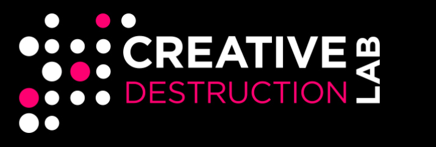

“If there weren’t luck involved, I would win every time.” - Phil Hellmuth

## Fantasy Sports Advice and Betting for the New World

Here at the Lord's Vig (LV) we offer state of the art tools for optimizing your fantasy sports teams and ensuring you make the best decisions when gambling. 

## Presentation

Slides to our presentation can be found [here](https://docs.google.com/presentation/d/1uoSEKO_CzY3tWiS7wWERNEAjORk5LXj8cneoCqp16gU/edit?usp=sharing).

## Market Size

Sports betting is a 203 BILLION dollar global industry. Couple that with the new betting regulations slowly being introduced; [See Canada's new Bill](https://www.cbc.ca/sports/single-event-sport-gambling-to-become-legal-as-bill-c218-passes-in-senate-1.6075816), the betting industry is set to grow even larger. Couple that with the market for Fantasy Sports, a [projected 320 million dollars in 2025](https://www.marketwatch.com/press-release/fantasy-sports-market-size-2021-with-growth-forecast-latest-industry-scope-and-future-trends-with-upcoming-technologies-global-business-share-analysis-till-2025-2021-07-06); and for [E-sports](https://www.gamesindustry.biz/articles/2021-05-27-ultimate-team-modes-make-up-29-percent-of-eas-business) which was an astounding 1.62 billion dollars for EA Sports alone last year, and you begin to see the importance of a platform to help users optimize their strategies and stay ahead of the competition.  Sports are such a treaseured part of every countries culture-as evidenced by the  Olympics currently being held in Japan. Betting and Fantasy help us further connect with the game, especially those of us who were never born with the athletic tools to succeed where others have. 

## Competitors

- FanDuel: valued slightly less than 1 billion, FanDuel offers sportsbook, daily fantasy sports, online casino and online horse race betting products. They do not offer immersive analytics to help you with these products. They have a 40% share in online betting markets in the U.S
- DraftKings: 19 billion dollar market cap;
- Bet 365: 

## Business Model

If we were to try to scale our package into a business we would plan on a SaS (Software as a service) model. We would offer users some resources for free to gain popularity; and then charge a flat monthly subscription rate (and offer a discounted yearly rate) to use our platform. For professional users (Sports teams, professional gamblers, ect) we would charge a higher rate, but maintain support and have custom analytics & reports prepared for these clients. For further information see below or at this [link](https://drive.google.com/file/d/1uL1ANnDee9dNKTsRR3arMqxqiVhFbkCI/view?usp=sharing).

## Technologies Used

LV is a python package that can be run locally. We make use of quantum hardware from DWave and IBM. We also make use of a photonics computer simulator from Xanadu. 

## Setup & How to Run

1. Make sure you have python 3 installed

2. Set up your preferred virtual environment.

3. pip install -r requirements.txt

4. On the command line, for a python script script_you_want_to_run.py:  python module/script_you_want_to_run.py 

6. (Optional) run the Jupyter Notebooks in the PythonNotebooks folder

