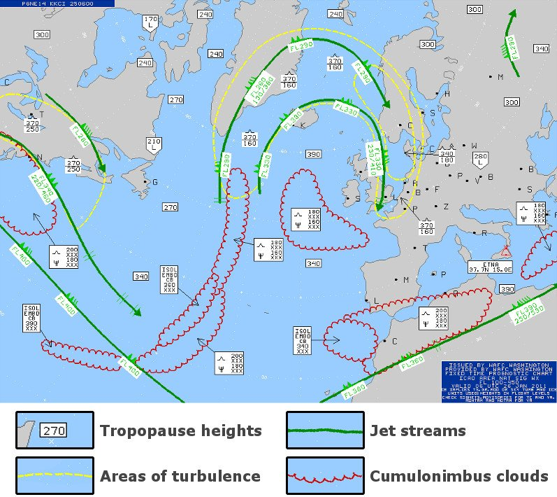
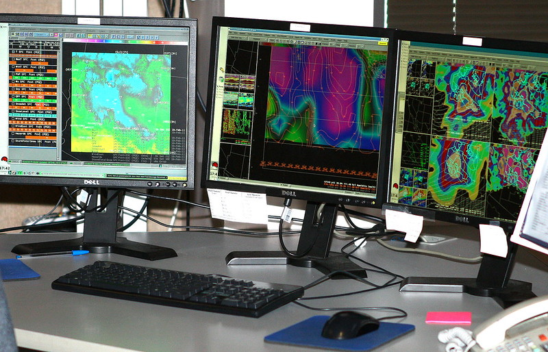
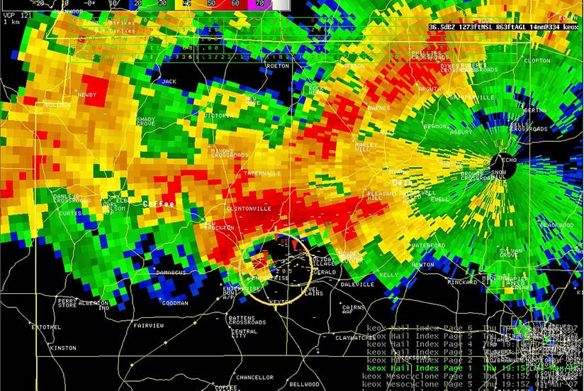

# Preamble
A vast amount of images generated from high resolution telescopes, satelites, on the ground cameras and other sources are processsed daily to get various insights affecting economies, businesses, individual lives. This necessitates the ability to store huge amounts of data. This may not be provided using classical computation. Durig image processing different techniques are involved feature recognition, classification, clustering. We focus on a classification problem, which belongs to supervised learning. Here quantum computing can be useful due to its ability to process huge amounts of data. The ability to perform an efficient mapping of classical data on quantum bits will open vast possibilities for various industries:

* weather forecasting (analyzed extensively in our business proposal below)
* emotion recognition and prediction - also known as affective computing - with market size US$29 billion in 2020 and expected to grow to US$140 billion by 2025 at CAGR of 37% [1]
* molecular modelling market - expected to grow at a rate of 14.43% in the forecast period of 2021 to 2028 and reach USD 7,2 billion by 2028 [2]
* nanotechnology - the global nanotechnollogy market was valued at USD 1 billion in 2018, and is projected to reach USD2,2 billion by 2025, growing at a CAGR of 10.5% from 2019 to 2025 [3].

We propose an image processing platform covering various verticals such as weather forecasting, emotion recognition to name a few. Image processing systems market is expected to reach USD 26 billion by 2027 growing at a growth rate of 21.8% [4]. The extensibility of the platform is given by the similarity of the problem as they belong to multi-class classification problems. They all can be modeled using recurrent neural networks due to their temporal interactions. In our detailed business proposal we describe the weather forecast image processing vertical.

# Business Pitch - 1QPoint Your Partner for Accurate Weather
<table align="center">
     <tr>
        <td></td>
        <td></td>
    </tr>
</table>

The chaotic nature of our atmosphere limits our ability to model it and predict what it will do next. A single weather model run several times with even subtle differences in starting conditions produces different predictions. Since every observation has an associated uncertainty these small imperfections can cause big changes in what a model predicts. These changes get bigger and bigger the further ahead you try to predict. Because of this, the potential predictability limit of weather is about two weeks. For big evnet suc has hurricanes and winter storms that are easy to spot in advance, the theoretical prediction limit is two to three weeks. 

Today’s five-day forecast is accurate about 90 percent of the time, the seven-day - about 80 percent, and a 10-day forecast - about 50 percent. Forecasts have become very accurate - today’s five-day hurricane forecast is more reliable than the four-day forecast in the early 2000s, and more reliable than a three-day forecast in the 1990s. Three- to 10-day forecasts have been improving by about a day per decade - meaning a modern six-day forecast is as accurate as a five-day forecast 10 years ago. As we see there is still potential to further improve accuracy in extending the forecast period [5].

Weather forecasts can be divided into three types: short term weather forecast (2-3 days), medium-term weather forecast (4–9 days), and long-term weather forecast (more than 10–15 days). According to the coverage area, the weather forecast can be divided into large-scale forecast (generally referring to the forecast of a continent or country), medium-scale forecast (usually referring to the forecast of a province (region), state, and region), and small scale forecast (such as the forecast of a county, city, etc.) [6]. 

## The problem
Despite the increased accuracy of weather forecasts over the years, weather and climate change related natural disasters are on the rise and cause deaths and substantial economic loss. The U.S. alone has sustained 298 weather and climate disasters since 1980 where overall damages/costs exceed $1.975 trillion. Since 1980 there have been 7 disaster events per year, costs were 48 billion $US/year, deaths - 353/year. In 2020 alone 22 events have resulted in ca. 100 billion $US damage and 262 deaths [7].

## The solution
1QPoint’s weather forecast platform takes advantage of hybrid algorithms and NISQ devices to extend the weather forecast day period and increase  accuracy. We start with a medium-scale forecast and medium-term weather forecast products. With proven results using proprietary algorithms we were able to classify wildfires, storms and demonstrate potential quantum advantage in weather anomaly detection. Given our expertise in QML (Quantum Machine Learning) our algorithms provide NISQ (Noisy Intermediate Scale Quantum) solutions as a Saas platform via techniques such as QSVM (Quantum Support Vector Machines) and QNN (Quantum Neural Networks). 

## The current state
To do weather forecasting we need observational data, mathematical modeling, and computation. Various sources, such as weather stations, satellites, sea buoys, commercial airliners and ships gather data from all around the world. Billions of observations are made every single day. Most weather agencies use supercomputers with amazing computational prowess. The supercomputers at the National Oceanic and Atmospheric Administration (NOAA), for example, can complete 2.8 quadrillion calculations every second. These supercomputers have now become crucial to generating global forecasts. The observational data used are temperature, pressure, wind humidity and clouds [8].

Researchers have used parameterizations to model the relationships underlying small-scale atmospheric processes and their interactions with large-scale atmospheric processes. Stochastic parameterizations have become popular for representing the uncertainty in subgrid-scale processes and they produce accurate weather forecasts and climate projections. It’s still a mathematically challenging method. Now researchers are turning to machine learning to provide more efficiency to mathematical models. 

Generative adversarial networks (GANs) have been used with a toy model of the extratropical atmosphere known as the L96 system, frequently used as a test bed for stochastic parameterization schemes. The GANs that provided the most accurate weather forecasts also performed best for climate simulations, but they did not perform as well in offline evaluations. The authors conclude that GANs are a promising approach for the parameterization of small-scale but uncertain processes in weather and climate models [9].

Many machine learning models have been implemented such as Extra Tree Regression, Random Forest Regression, Support Vector Regression and Ridge Regression for weather forecasting. They have found Random Forest Regressor to be a better regressor as it ensembles multiple decision trees while making decisions. Their evaluation results have shown that machine learning models can give accurate results comparable to the traditional models. Convolutional Networks, Conditional Restricted Boltzmann Machine, Recurrent Neural Network have been compared. RNN method was found to give adequate accuracy when compared to the other models. Different combinations of weather parameters such as pressure, temperature, dewpoints, wind speed, precipitation and many other weather parameters were used to train LSTM. The LSTM algorithm has given substantial results accuracy wise, among other weather prediction techniques [10].

## Why now
We believe the true representation and description of a chaotic system such as the weather can be achieved with quantum computing and algorithms due to the underlying similarity of both systems. Quantum is at the beginning of its realisation potential. We are aware of the limitations of NISQ devices and this helps us build better solutions by incorporating technology advancements as soon as they are achieved. Perdicting the behaviour of inherently complex systems such as the weather can be improved with quantum devices.

## Business model
We offer our forecast products in a SaaS subscription model.

<table align="center">
     <tr>
        <td></td>
        <td></td>
    </tr>
</table>

## Verticals
The platform assists following industries to optimize weather risk:
* The global aviation weather forecasting services market is projected to reach US$ 447.6 million in 2024 [11].
* Energy and utilities: From causing outages to affecting energy consumption rates, the weather can have a significant impact on energy and utilities.
* Ground transportations: If drivers aren’t prepared, harsh conditions such as icy roads, poor visibility and violent storms may lead to delays, accidents or serious injuries. Applying AI and analytics to weather and traffic data helps transportation companies and their drivers make better decisions about impending conditions. 
* Insurance: Insurers use data and analytics to discover ways to improve policyholder satisfaction, manage risk, reduce claims. 
* Retail: The correlation between weather and consumer buying patterns is rarely utilized when predicting retail trends. But even more often overlooked is weather's impact on supply chain management, product demand and pricing. 

## Global weather forecast market
The weather forecasting systems market is estimated to be USD 2.3 billion in 2019 and is projected to reach USD 3.3 billion by 2025, at a CAGR of 5.7% from 2019 to 2025 [12]. Increasing demand for weather forecasting using big data analytics and rise in climate change patterns resulting in uncertainties related to rainfall are major factors expected to drive the growth of the weather forecasting systems market, globally. The software solution segment is projected to grow at the highest CAGR during the forecast period with North America to lead the weather forecasting systems market from 2019 to 2025.

Market growth in North America is driven majorly by the increased demand for highly accurate weather forecasting systems from the aviation and commercial industries. The region is considered to be the largest developer, operator, and exporter of weather forecasting systems, globally. The US and Canadian governments are investing increasingly for the enhancement of their respective weather forecasting agencies.

## Product roadmap and platform strategy
<table align="center">
     <tr>
          <td></td>
    </tr>  
</table>
<table align="center">
     <tr>
      <td>  The following visualization shows a storm prediction feature used in the QNN and QPC.</td>
     </tr>    
</table>

**Products:**  Our first product, CloudQ targets the attractive aviation weather forecast market. It also provides a storm detection feature. It surves as a basis for our SolarPowerQ product which predicts solar electricity generation less than a few hours in advance. To get solar forecasts SolarPowerQ precisely locates where each cloud will be relative to a solar array, and how the size and shape of the clouds influence how much sunlight gets through to the solar panels. By maximizing the solar panel output, fossil fuel power stations are run less, and by doing so we reduce CO2 emissions and their impact on climate change [13]. Eventhough this product does not directly relate to weather forecast energy utility clients love it as they contribute to climate change mitigation. Our next product PrecipitationQ is more challenging to forecast than temperature due to the discontinuous nature of the phenomena [14]. Our goal is to bundle the diffrent data points we collect from clouds, wildfires etc. and extend the medium-term weather forecast feature from (4–9 days) to 5-10 forecast period with WeatherQ+ product.

## Competitors and competitive advantage
**Key players:** The Weather Company (US), Vaisala (Finland), Sutron Corporation (US), Campbell Scientific (US), Airmar Technology Corporation (US), All Weather, Inc. (US), Morcom International (US), Columbia Weather Systems (US), G. Lufft Mess-und Regeltechnik (Germany), and Skye Instruments (UK), among others.

<table align="center">
    <tr >
        <td> <b>Company name</b> </td>
        <td> <b>Headquarter</b> </td>
        <td> <b>Profit in USD</b></td>
    </tr>
    <tr>
        <td>The Weather Company/IBM Parent Company</td>
        <td>USA</td>
        <td>N/A</td>
    </tr>
    <tr>
        <td>Vaisala</td>
        <td>Finland</td>        
        <td>447.85 million</td>
    </tr>
    <tr>
        <td>Sutron Corporation </td>
        <td>USA</td>        
        <td>26 million</td>
     </tr>    
     </tr>          
</table>

**The market:** Increase in number of natural disasters due to undesired climatic changes drives the growth of the global market. Reliable weather forecasting can lead to reduction in operational and maintenance costs for business operations, reduce disaster recovery cost and lead to flexible insurance policies. On the supply side, increasing the accuracy of machine learning techniques and improvement in data fusion methods leads to increasing accuracy of predictions. Our vision is to become the weather forecast partner for governments and universities.

**Value proposition:** our platform increases image processing accuracy across attractive verticals such as weather forecasting, emotion recognition and others. 

**Our advantage:** agile, scalable platform focused solely on weather forecasting using hybrid machine learning algorithms and methods across relevant verticals. Our biggest strength is our highly skilled team of PhDs, (quantum) machine learning engineers and architecture design experts with combined academia research, industry and corporate consulting experience of 35 years.

## Potential customers
A single public weather service is typically the only source available for forecasts, warnings and alerts. These meteorologists work for public (government) organizations or universities. By contrast, the United States has strong public, private (commercial) and university-based weather observation and forecasting programs. Commercial weather providers typically have some weather modeling capabilities and fill a different niche like, surfing conditions, fire conditions or transportation concerns, based on specific observations and models that refine the broad public-sector data.

Clients: National Oceanic and Atmospheric Administration (NOAA)/USA, Government of Canada Weather Information Service, University of Oklahoma

## Conclusion
1QPoint aims to leverage current NISQ devices to deploy classical, hybrid and quantum inspired algorithms and machine learning to model weather forecast-relevant data points and deliver more accurate medium-term and medium-scale weather forecasts. Our products help industries such as aviation, insurance, energy and utilities and retail to optimize operation and maintenance cost, optimize weather risks and increase value provided to their customers. We help governments to reduce disaster recovery costs and save people’s lives due to severe natural events with timely and accurate weather predictions. 

Our advantage lies in an agile and scalable platform tuned to address weather complexity using cutting edge techniques. Our strength is our team of PhDs and (quantum) machine learning engineers with a combined expertise of 35 years in academia research, management and consulting. We envision ourselves as the go to partner for accurate weather predictions that save people’s lives and help business thrive.

## References

[1] [Affective Computing Market](https://www.researchandmarkets.com/reports/5129183/affective-computing-market-by-technology-touch?utm_source=dynamic&utm_medium=BW&utm_code=rqsnlt&utm_campaign=1326637+-+%2490+Billion+Affective+Computing+Market+by+Technology%2c+Component%2c+Hardware%2c+Vertical%2c+and+Region+-+Global+Forecast+to+2024&utm_exec=chdo54bwd). Accessed July 28 2021.

[2] [Molecular Modelling Market](https://www.databridgemarketresearch.com/reports/global-molecular-modelling-market/). Accessed July 28 2021.

[3] [Nanotechnology Market](https://www.alliedmarketresearch.com/nanotechnology-market). Accessed July 28 2021.

[4] [Global Image Processing Systems Market](https://www.databridgemarketresearch.com/reports/global-image-processing-systems-market). Accessed July 28, 2021

[5] [How Weather Forecasts Are Made](https://www.discovermagazine.com/planet-earth/how-weather-forecasts-are-made). Accessed July 26, 2021.

[6] [Zhang, J. et al.. 2021. Support Vector Machine Weather Prediction Technology Based on the Improved Quantum Optimization Algorithm](https://www.hindawi.com/journals/cin/2021/6653659/)

[7] [Billion-Dollar Weather and Climate Disasters: Overview | National Centers for Environmental Information (NCEI)](https://www.ncdc.noaa.gov/billions/). Accessed July 26, 2021 

[8] [How Does Weather Forecasting Work?](https://www.scienceabc.com/innovation/how-does-weather-forecasting-work.html#how-does-weather-forecasting-work). Accessed July 26, 2021

[9] [Machine Learning Improves Weather and Climate Models](https://eos.org/research-spotlights/machine-learning-improves-weather-and-climate-models). Accessed July 27, 2021

[10] [Kashyap, P. et al. 2020. Intelligent Weather Forecasting using Machine Learning Techniques](https://www.irjet.net/archives/V7/i3/IRJET-V7I3499.pdf)

[11] [Aviation Weather Forecast Market](https://www.stratviewresearch.com/367/Aviation-Weather-Forecasting-Services-Market.html). Accessed July 26, 2021

[12] [Weather Forecast Systems Market](https://www.marketsandmarkets.com/Market-Reports/meteorological-weather-forecasting-systems-market-29645152.html).  Accessed July 26, 2021

[13] [Faulty Weather Forecasts Are a Climate Crisis Disaster](https://www.wired.com/story/bad-weather-forecasts-climate-crisis-disaster/ ). Accessed July 26, 2021

[14] [How Weather Forecasts Are Made](https://www.discovermagazine.com/planet-earth/how-weather-forecasts-are-made). Accessed July 26, 2021

