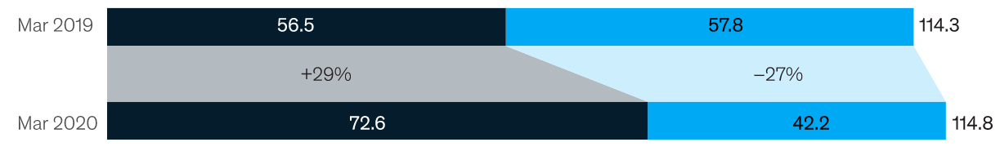
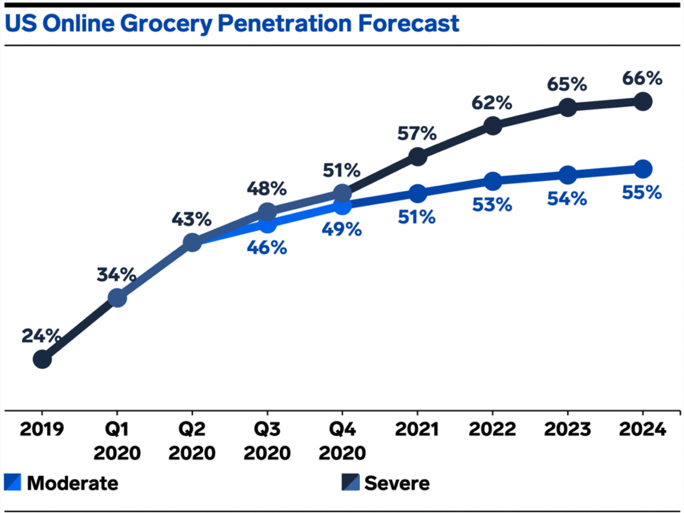
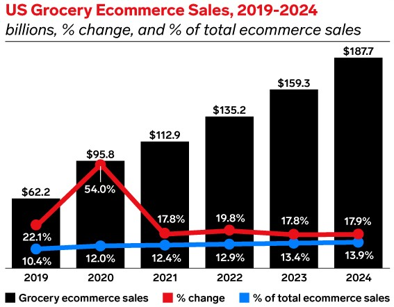
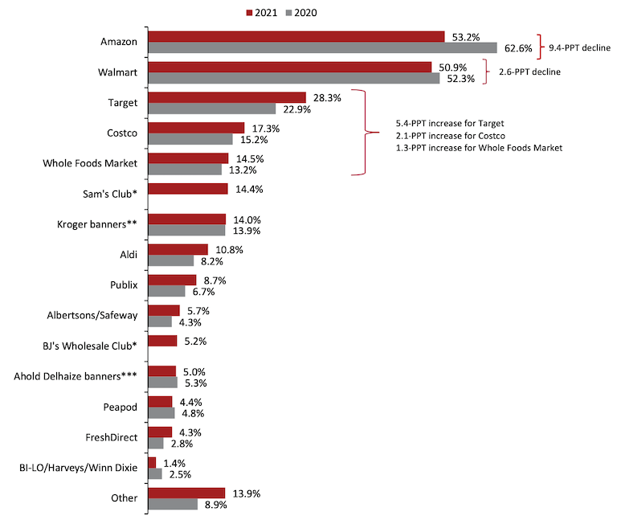

  

  

## Building a Resilient Supply Chain for a Better World

## Introduction

Intricate production networks were designed for efficiency, cost, and proximity to markets but not necessarily for transparency or **_resilience_**. Now companies are operating in a world where disruptions are **_regular occurrences_**. Averaging across industries, companies can now expect supply chain disruptions lasting a month or longer to occur every 3.7 years, and the most severe events take a major financial toll [Source](https://www.mckinsey.com/business-functions/operations/our-insights/risk-resilience-and-rebalancing-in-global-value-chains).

Disruptions are serious and costly events, although on a smaller scale than catastrophes. They, too, can be split into those that telegraph their arrival in advance and unanticipated events such as logistics disruptions, data breaches, product recalls, and industrial accidents. Disruptions have several impacts across different industries and the supply chain will be critical to supplying goods and services quickly, safely and securely. Business leaders across the supply chain industry must make rapid decisions, and take immediate actions to sustain business operations to serve their customers, clients and communities, as well as protect and support their workers. To have responsive supply chain in the future, it needs to be characterized by both resilience and responsibility. [Source](https://www.accenture.com/be-en/insights/consulting/coronavirus-supply-chain-disruption).

According to a global survey of supply chain executives conducted by The Economist Intelligence Unit, retail sector respondents are **_less likely_** to agree that their organizations react well to disruptions in the supply chain. [Source](https://eiuperspectives.economist.com/strategy-leadership/retail-supply-chains-learning-lessons-disruption).

There are some key issues why retail industry could not react well to disruption in the supply chain such as high **_fluctuation_** in customer demand, lack of flexibility allowing quick reaction to changes, and meeting customer expectations. Among all the sectors in retail industry, **_grocery_** is one of those industries that has been turned upside down by the pandemic, not only once but multiple times as consumers respond to the evolving situation. 

Until early 2020, consumer spending on food in the United States had been remarkable stable, growing by around 4 percent over the previous five years. As it is shown in below illustration, total sales were roughly split evenly between retail outlets (such as grocery stores and supermarkets) and food-service companies (such as restaurant, hospitals and schools). The revenue has increased steadily until February. However, after the pandemic the trend of consumer spending on foods has changed and grocery sales has increased dramatically by 29 percent over the prior year.

  
  <a href="https://www.mckinsey.com/industries/consumer-packaged-goods/our-insights/us-food-supply-chain-disruptions-and-implications-from-covid-19">Source</a>

Currently, about 60% of US consumers now buy groceries online and the same percentage of theses shoppers plan to do so at the **_same frequency or more_** once the pandemic crisis subsidies [Source](https://www.supermarketnews.com/online-retail/online-grocery-shopping-grows-amid-pandemic-induced-channel-stickiness). Although online grocery stores are benefiting from significant demand increases from demand previously met by food-service companies. However, they face additional challenges and extraordinary activities to protect and serve their consumers. Surge in demand forces companies to increase their level of inventory to fulfill their customers’ needs. Therefore, managers need to find a solution to keep their inventory cost at a reasonable level. **_Supplier selections_** play vital role in inventory profit maximization and operational cost reduction. ZebraKet specializes in inventory management, helps e-grocery companies to find a **_best set_** of suppliers and **_minimize_** their inventory costs using complicated mathematical formula and quantum computing. 

## Market overview

The shift in consumer habits propelled platform adoption and provided a boon to grocer retailers in 2020. Today, retailers may be pondering how to keep up the momentum. Market research shows that the habits that have been formed during the pandemic, including the shift to convenient and safe purchasing of essential grocery items are unlikely to change. Studies shows that 60% of online shoppers plan to buy their groceries that way around the same frequency or more frequently post-pandemic, with 12.6% saying they’ll do so much more often, 11.6% slightly more and 35.6% at about the same rate [Source](https://www.supermarketnews.com/online-retail/online-grocery-shopping-grows-amid-pandemic-induced-channel-stickiness).

In US, consumer have turned to online grocery shopping services for the first time during pandemic. In 2020 online grocery adoption has rapidly accelerated in the US. Figure below shows that online grocery penetration in the US will reach up to 66% percent in severe case where people are fully vaccinated by 2022.  

  
  <a href="https://www.businessinsider.com/online-grocery-report-2020">Source</a>

US food and beverage retail e-commerce sales reached almost $24 billion in 2020 and it is expected to surpass $38 billion in 2023 giving the industry a compound annual growth rate (CAGR) of 17.3% during this span [source](https://www.businessinsider.com/online-grocery-report-2020). Studies show that the online grocery services that are best able to “handle” surging order volume will likely be the most popular services “after” the pandemic subsides  because customers will be able to “rely” on those services to consistently bring them groceries [Source](https://www.businessinsider.com/online-grocery-report-2020).

## Growth Rate

Online grocery sales grew 54.0% in 2020 to reach $95.82 billion. That propelled it to a 12.0% share of total US ecommerce sales and 7.4% of all grocery sales. Looking ahead, growth will slow as the vaccine rollout allows shoppers to more comfortably return to stores. Nevertheless, a portion of online grocery shopping will remain, pushing past $100 billion in spending for the first time in 2021, a full year ahead of previous estimates. And by 2023, online grocery sales will make up 11.2% of total US grocery sales [Source](https://www.emarketer.com/content/2021-online-grocery-sales-will-surpass-100-billion).

  
  <a href="https://www.emarketer.com/content/2021-online-grocery-sales-will-surpass-100-billion">Source</a>

The growth of grocery ecommerce sales can largely be attributed to first-time buyers entering the market. Last year, the number of digital grocery buyers ages 14 and older in the US (who made a purchase at least once during the year) jumped 42.6% to 131.6 million. By 2022, it is expected that more than half (51.3%) of the US population will be digital grocery buyers. The growth of online grocery sales will also be driven by higher spending per buyer. Recent studies estimate that annual spending per buyer at $818 in 2021. By 2023, it is expected that figure to exceed $1,000 [Source](https://www.emarketer.com/content/2021-online-grocery-sales-will-surpass-100-billion).

## Benchmarking

In 2020, the global cost of overstocking goods was $530 billion, while the cost of under-stocking was more than $680 billion. There are several approaches to reduce the costs and maximize inventory profit. In Zebraket, we focus on optimum set of suppliers in order to meet the customers’ requirements and minimize the inventory cost at the same time. First, we look at the classical methods to solve supplier selection problem and inventory profit maximization.
There are two main approaches to tackle supplier selection problem. single-criterion synthesis approach and multi-objective optimization models using mathematical optimization involving more than one objective function to be simultaneously optimized. Studies show that the number of **_pre-selection methods_** is limited despite this step is very important in the supplier selection process. This screening process makes identifying a suitable subset of suppliers and reduces the large set of initial suppliers to a smaller manageable set of acceptable suppliers by ranking them under a pre-defined set of criteria. Among the benefits of this pre-qualification step is that the possibility of rejecting good suppliers at an early stage is reduced [Source](https://link.springer.com/article/10.1007/s40092-019-00334-y).

In Zebraket, we are attempting to overcome supplier selection problem with the aim of maximizing inventory profit in an unpredictable and **_chaotic_** business environment. Our ultimate integrated multi-variables model will include both qualitative and quantitative criteria to provide best solution for your multi-criteria supplier selection problem. In order to select the best suppliers, it is necessary to make a tradeoff between tangible and intangible criteria, some of which may conflict. Zebraket exploits cutting-edge technology and new methods to bring **_resilience_** and agility into your inventory management system. Unlike conventional methods our breakthrough technique reduces your dependency on **_single supplier_** while the inventory profit and reliability of the inventory management system will be maximized. The table below compares the merits of conventional methods and our own integaretd technique. 

| Merits | Zebraket Technique | Conventional Methods |
|-----------|-----------------|----------------------|
|	Adapt the inventory management system with multiple-supplier strategy|:white_check_mark:||
| Reduce order transaction cost|:white_check_mark:|:white_check_mark:|
| Increase accuracy and reliability of decision making in the shortest possible time|:white_check_mark:||
| Enhance the level of safety stock|:white_check_mark:|:white_check_mark:|
| Pre-selection step in the supplier selection process (Identifying the most suitable subset of suppliers)|:white_check_mark:||
| Reduce vulnerability of supply|:white_check_mark:||
|Partnership between buyer and suppliers|:white_check_mark:|:white_check_mark:|
|Reduction of risk of opportunistic behaviour||:white_check_mark:|
|Mitigate risk of supply interruption|:white_check_mark:||
|Reduce probability of bottlenecks due to insufficient production capacity to meet peak demand|:white_check_mark:||
| Lower inventory holding cost|:white_check_mark:|:white_check_mark:|
|Increased competition among suppliers leads to better quality, price, delivery, product innovation|:white_check_mark:||
|Enhance the bargaining power of buyers|:white_check_mark:||
|More flexibility to react to unexpected events that could endanger supplier’s capacity|:white_check_mark:||

## Competitors

In this market, there are several competitors that provide software or application to maximize the inventory profit. Microsoft dynamic 356 helps managers to configure and manage procurement and vendors. Bright source allows you to manage vendor profiles and automatically suggest the best vendor for the job based on price, inventory level and fulfillment times. SAP Ariba enables companies to digitalized their processes end-to-end on a single and integrated platform in the cloud.
Apart from them, there are several other optimization models for inventory management. Inventory tracker which functions as a comprehensive inventory tracking system for iPad. SOS inventory which integrates with QuickBooks and offers expanded features such as sales orders. Lettuce is not just an inventory app and it integrates such system as order capture, payment processing, shipping, tracking , customer relationship management and more. Oracle supply chain management and manufacturing connects supply network with an integrated suites of cloud business application designed. 

## Customers

There are several retailers that online grocery shoppers can buy their groceries. Here we look at the first three retailers. Based on Coresight Research, Amazon and Walmart remain the top venue for online grocery shoppers. 

  
  <a href="https://coresight.com/research/us-online-grocery-survey-2020-many-more-shoppers-buying-more-categories-from-more-retailers/">Source</a>

According to the Coresight Research, from March 2020 to April 2021, 53% of those polled bought groceries online at Amazon while 50.9% did so at Walmart. Other retailers cited as online grocery shopping destinations by respondents and saw increases in e-customers from 2020 to 2021 included Target at 28.3% (+5.4% from 2020), Costco at 17.3% (+2.1%), Whole Foods Market at 14.5% (+1.3%), Sam’s Club at 14.4% (change N/A), The Kroger Co. at 14% (+0.1%), Aldi at 10.8% (+2.6%), Publix at 8.7% (+2%), Albertsons Cos. at 5.7% (+1.4%), BJ’s Wholesale Club at 5.2% (change N/A), Ahold Delhaize USA at 5% (-0.3%) and Southeastern Grocers at 1.4% (-1.1%). Among online grocers, 4.3% of consumers cited FreshDirect (+1.5%) and 4.4% cited Ahold Delhaize USA’s Peapod (-0.4%) [Source](https://coresight.com/research/us-online-grocery-survey-2020-many-more-shoppers-buying-more-categories-from-more-retailers).

|Company Name|Country|Net Profit ↑ |Market Cap|
|------------|-------|----------|----------|
|Amazon.com|USA|$ 21.23 billion| $ 1.811 trillion|
|Walmart|USA|$ 15.2 billion|$ 399.166 billion|
|Target corporation|USA|$ 4.368 billion|$ 126.869 billion|
|Costco|USA|$ 4.0 billion|$ 187.19 billion|

According to TABS analytics’ 8th Annual Food and Beverage Consumables Study, Walmart overtaken Amazon in share of online grocery transaction in 2019. Walmart garnered a 30% share of online food and beverage retails transactions, down slightly from 30.4% but pushing the retail giant ahead of Amazon. Meanwhile, e-commerce grocery players like FreshDirect, NetGrocer, Peapod and Instacart, among others, achieved significant gains in online transaction share, Jetta noted. Grouped as “other” in the TABS study, these operators had a 16.7% share of online grocery transactions, up from 7.9% a year ago. TABS also estimated this group’s percentage growth in online grocery transactions at 140%, compared with gains of 14% for Walmart and 12% for conventional supermarkets and 4% decreases for Amazon and Targe [Source](https://www.supermarketnews.com/online-retail/study-walmart-surpasses-amazon-online-grocery-share).

However, over the next five years, Amazon will nearly double its online food and beverage sales globally, holding its grocery e-commerce lead over rival Walmart. Amazon’s online edible grocery sales are projected to climb to **_$26.7_** billion worldwide in 2026 from **_$14.5_** billion in 2021, a compound annual growth rate (CAGR) of 13%. Walmart also will see strong growth, but not enough to overtake Amazon. Edge Retail Insight forecast a 14.1% CAGR for Walmart’s edible grocery e-commerce sales over the next five years, from $ 10.1 billion globally in 2021 to $ billion in 2026 [Source](https://www.supermarketnews.com/online-retail/amazon-nearly-double-online-edible-grocery-sales-2026).

## REFERENCES

1. [Mckinsey-Resilient_rebalancing](https://www.mckinsey.com/business-functions/operations/our-insights/risk-resilience-and-rebalancing-in-global-value-chains)
2. [Accenture-Supply-chain-distruption](https://www.accenture.com/be-en/insights/consulting/coronavirus-supply-chain-disruption)
3. [Accenture-Supply-chain-distruption](https://www.accenture.com/be-en/insights/consulting/coronavirus-supply-chain-disruption)
4. [ McKinsey-US food supply chain: Disruptions and implications from COVID-19](https://www.mckinsey.com/industries/consumer-packaged-goods/our-insights/us-food-supply-chain-disruptions-and-implications-from-covid-19)
5. [Online-grocery-shop](https://www.supermarketnews.com/online-retail/online-grocery-shopping-grows-amid-pandemic-induced-channel-stickiness)
6. [Online-grocery-shopping-grows](https://www.supermarketnews.com/online-retail/online-grocery-shopping-grows-amid-pandemic-induced-channel-stickiness)
7. [US-online-grocery-market](https://www.businessinsider.com/online-grocery-report-2020)
8. [US-egrocery-growth](https://www.businessinsider.com/online-grocery-report-2020)
9. [US-egrocery-market](https://www.businessinsider.com/online-grocery-report-2020)
10. [Growth-rate](https://www.emarketer.com/content/2021-online-grocery-sales-will-surpass-100-billion)
11. [US-grocery-ecommerce-sales](https://www.emarketer.com/content/2021-online-grocery-sales-will-surpass-100-billion)
12. [US-egrocery-growth-rate-factors](https://www.emarketer.com/content/2021-online-grocery-sales-will-surpass-100-billion)
13. [Benchmarking-springer](https://link.springer.com/article/10.1007/s40092-019-00334-y)
14. [E-grocery-share](https://coresight.com/research/us-online-grocery-survey-2020-many-more-shoppers-buying-more-categories-from-more-retailers/)
15. [Market-share](https://coresight.com/research/us-online-grocery-survey-2020-many-more-shoppers-buying-more-categories-from-more-retailers)
16. [Online-grocery-share](https://www.supermarketnews.com/online-retail/study-walmart-surpasses-amazon-online-grocery-share)
17. [Amazon-overtakes-walmart-market-share](https://www.supermarketnews.com/online-retail/amazon-nearly-double-online-edible-grocery-sales-2026)

