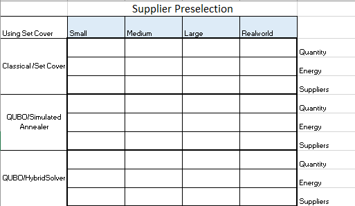

<p align="center">
  
</p>

## Project Description 
We show how an online grocer will optimize between two objectives: 
1) selection on least number of suppliers providing all required inventory 
2) maximizing inventory profit

We also provide a novel approach to solving competing supply-chain objectives through our Chained Optimization Rules Engine&reg; CORE&reg; method. This allows one to arbitrarily chain QUBOs together and solve complex optimization problems via multiple simple QUBOs.

## Setup
1. Make sure you have Anaconda installed and configured.
2. `conda env create -f environment.yml`
3. `conda activate zebraket-cdl-hackathon-2021`
    
Original environment creation steps (*only do this if step 2 did not work*): 
```
conda create -n zebraket-cdl-hackathon-2021 python=3.9
conda activate zebraket-cdl-hackathon-2021
conda install ipykernel
conda install pylint
conda install pandas
pip install dwave-ocean-sdk
```

3. If you have not already, set your dwave API key with
  `dwave config create`


## How to Use

We recommend you checkout our [notebooks](./notebooks/README.md) with detailed information about our code. 

## Challenges Solved

### Objective 1: Supplier Optimization
We formulate and solve a typical logistic problem for an online grocer: minimize the number of suppliers needed to fill your inventory. See this [notebook](./notebooks/SetCoverBQM.ipynb) for more details. In brief, this is done by modelling the problem as a "set cover" problem:

<p align="center">
  
</p>

This can be converted into a binary quadratic model (BQM) and solved. We use D-Wave's Hybrid Solver and solve it on a real dataset as well as simulated small, medium and large sized dataset. 

### Objective 2: Profit Optimization
We formulate and solve another typical logistic problem for an online grocer: maximize overall profit by selecting an optimal set of inventory. See this [notebook](./notebooks/KnapsackDQM.ipynb) for more details. In brief, we formulate the problem as a discrete knapsack formulation:
<p align="center">
  
</p>

We develop a discrete quadratic model (DQM) formulation of this using Andrew Lucas's formula[1]. However, we use our own Lagrange terms. We use D-Wave's Hybrid Solver and solve it on a real dataset as well as simulated small, medium and large sized dataset. 

- Summary of Results

Results for objective 1: Suppliers (QTY & List of Suppliers)

<p align="center">
  
</p>


Results for objective 2: Inventory Profit (Total Profit Potential, Inventory)

<p align="center">
  
</p>

## Project Details: 
  - Further walkthrough of what you did 

  The overall scope of our project was to show that multiple objectives can be handled together through a process of chaining and that gives comparable results to solving both objectives together.

  The diagram below shows the overall objectives and process. Detailed account of the formulae, QUBO and execution along with results are in the jupyter notebooks.  
  
<p align="center">
  
</p>

The detailed explanation of the business motivation, importance of this use case and applicability to other industries and similar competing objectives is described in the business applications document.

For more details refer to the [Business Application](./Business_Application.md)

  - Links to any Jupyter notebooks/scripts
  - Link to Presentation

## Contributors 
Alex Khan, Theo Cleland, Ehsan Torabizadeh, Ziwei Qiu

## References
[1] Lucas, A., 2014. Ising formulations of many NP problems. Frontiers in physics, 2, p.5.
