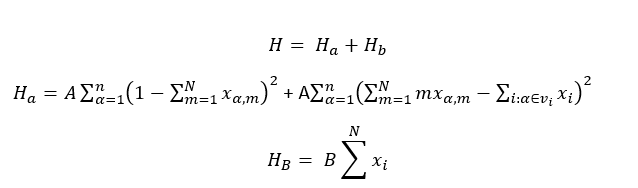
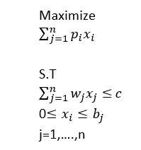
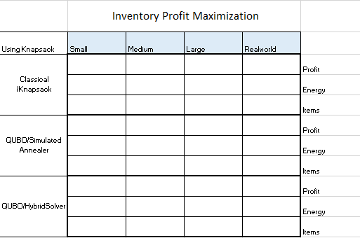
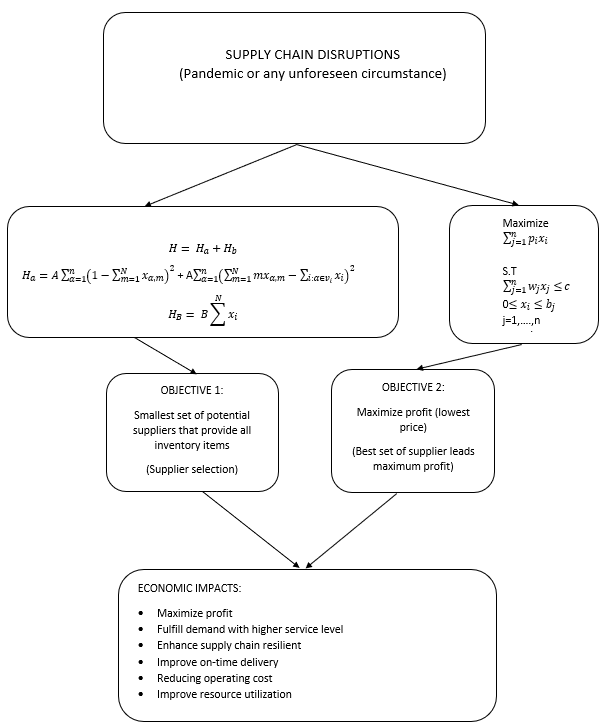

<p align="center">
  
</p>

## Project Description 
We show how an online grocer will optimize between two objectives: 
1) selection of least number of suppliers providing all required inventory 
2) maximizing inventory profit

We also provide a novel approach to solving competing supply-chain objectives through our Chained Optimization Rules Engine&reg; CORE&reg; method. This allows one to arbitrarily chain QUBOs together and solve complex optimization problems via multiple simple QUBOs.

## Setup
1. Make sure you have Anaconda installed and configured.
2. `conda env create -f environment.yml`
3. `conda activate zebraket-cdl-hackathon-2021`
    
Original environment creation steps (*only do this if step 2 did not work*): 
```
conda create -n zebraket-cdl-hackathon-2021 python=3.9
conda activate zebraket-cdl-hackathon-2021
conda install ipykernel
conda install pylint
conda install pandas
pip install dwave-ocean-sdk
```

3. If you have not already, set your dwave API key with
  `dwave config create`


## How to Use

We recommend you checkout our [notebooks](./notebooks/README.md) with detailed information about our code. 

## Data Used

We compiled a real dataset from [external sources](https://www.dunnhumby.com/source-files/), and simulate 3 [datasets](./data/README.md) of randomly generated data of varying sizes. Each dataset is a csv file containing product costs per supplier. The sizes of these datasets are summarized below:

| | # Products | # Suppliers |
| ----- | ----- | ------ |
| Real World | 29 | 36 |
| Small  | 10 | 20 | 
| Medium | 100 | 40 |
| Large | 200 | 80 |

## Challenges Solved

### Objective 1: Supplier Optimization
We solve a typical logistic problem for an online grocer: minimize the number of suppliers needed to fill your inventory. See this [notebook](./notebooks/SetCoverBQM.ipynb) for more details of the formulation. In brief, this is done by modelling the problem as a "set cover" problem:

<p align="center">
  
</p>

Which can be converted into a binary quadratic model (BQM) and solved. 

### Objective 2: Profit Optimization
We solve another typical logistic problem: maximize overall profit by selecting an optimal set of inventory. See this [notebook](./notebooks/KnapsackDQM.ipynb) for more details on the formulation. In brief, we model the problem as a discrete knapsack problem:
<p align="center">
  
</p>

Which can be converted into a discrete quadratic model (DQM) using Andrew Lucas's formula[1]. However, we use our own Lagrange terms.

### Objective 3: QUBO Chaining
The overall goal of our project was to show that multiple objectives can be handled together through a process of chaining and that gives comparable results to solving both objectives together. You can see a prototype of this framework in this [notebook](./notebooks/QuboChain.ipynb). This chaining allows one to attach an arbitrary number of QUBOs together and optimize them all together. In particular, we chain the objective 1 to objective 2, and optimize them together.

## Summary of Results

We tested objective 1 and 2 on D-Wave's Hybrid Solver, a simulated annealer as well as a brute force classical method. These solvers are compared on all datasets. The results are summarized below:

### Results for objective 1: Suppliers (QTY & List of Suppliers)

| | | Small | Medium | Large | Real World|
| - | - | - | - | - | - |
| Classical (Set Cover) | Energy<br/>Suppliers (#) | N/A<br/>2 | N/A<br/>2 | N/A<br/>2 | Not run yet |
| QUBO (Simulated Annealer) | Energy<br/>Suppliers (#) | 14<br/>7 | 1111<br/>36 | 3694<br/>78 | Not run yet |
| QUBO (Hybrid Solver) | Energy<br/>Suppliers (#) | -23<br/>3 | 888<br/>36 | 5354<br/>76 | Not run yet |

### Results for objective 2: Inventory Profit (Total Profit Potential, Inventory)

| | | Small | Medium | Large | Real World|
| - | - | - | - | - | - |
| Classical (Knapsack) | Profit (CAD)<br/>Cost (CAD)<br/>Run Time (sec) | Run forever<br/>Run forever<br/>Run forever | Run forever<br/>Run forever<br/>Run forever | Run forever<br/>Run forever<br/>Run forever |  Run forever<br/>Run forever<br/>Run forever | 
| QUBO (Simulated Annealer) | Profit (CAD)<br/>Cost (CAD)<br/>Run Time (sec) | N/A<br/>N/A<br/>N/A | N/A<br/>N/A<br/>N/A | N/A<br/>N/A<br/>N/A | N/A<br/>N/A<br/>N/A | 
| QUBO (Hybrid Solver + Fixed Bound) | Profit (CAD)<br/>Cost (CAD)<br/>Run Time (sec) | 403.06<br/>201.53<br/>13.43 | 579.73<br/>289.96<br/>68.69 | Run forever<br/>Run forever<br/>Run forever | 83.2<br/>41.6<br/>16.92 | 
| QUBO (Hybrid Solver + Variable Bound) | Profit (CAD)<br/>Cost (CAD)<br/>Run Time (sec) | 529.92<br/>264.96<br/>11.65 | 584.49<br/>292.24<br/>29.23 | Run forever<br/>Run forever<br/>Run forever | 62.14<br/>31.07<br/>12.62 | 

Results for objective 3: QUBO Chaining

<p align="center">
  
</p>

## Project Details

The diagram below shows the overall objectives and process of the first two objectives. Recall the third objective and the motivation of the project is to be able to chain QUBOs together to solve an arbitrary number of problems.
  
<p align="center">
  
</p>

The detailed explanation of the business motivation, importance of this use case and applicability to other industries and similar competing objectives is described in the [Business Application](./Business_Application.md) document.

### Project resources:

- [Jupyter Notebooks](./notebooks/README.md)
- [Business Application](./Business_Application.md)
- [Link to Presentation](./ZebraKet.pptx)

## Contributors 
Alex Khan, Theo Cleland, Ehsan Torabizadeh, Ziwei Qiu

## References
[1] Lucas, A., 2014. Ising formulations of many NP problems. Frontiers in physics, 2, p.5.
