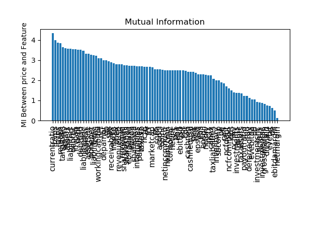

Fill in this README.md. Example Structure:

## Project Description 
(3-4 lines about what it is and how you did it)

## Setup
Example:
1. Make sure you have X installed and configured.

2. Set up your preferred virtual environment.

3. pip install -r requirements.txt

## How to Use
Example:
From command line: Use python solvers/script.py -h

## Project Details: 

#### Quantum Features selection

We use the Mutual Information QUBO method to extract relevant features from a real-world financial data set. The techniques used where borrowed from this repository (https://github.com/dwave-examples/mutual-information-feature-selection). To calculate asset scores, first, a subset of the fundamental metrics, most relevant to price or logarithmic price return are selected using Mutual Information QUBO (MIQUBO) algorithm. Then, the score is calculated based on the selected features and their quarter over quarter trend.

#### Static/Dynamic Portfolio Optimization problem

Once the QBE's portfolio is selected, it will be optimized dynamically on D-wave's LeapHybridSolver which offers a re-balancing path during the desired time frame with advantageous speed. MIQUBO scores will be updated monthly. This offers the opportunity to update the QBE's portfolio composition. The decision to update can be made based on the performance of the new portfolio versus the current using D-wave's LeapHybridSolver.

This work is inspired from the paper: *Dynamic Portfolio Optimization with Real Datasets Using Quantum Processors and Quantum-Inspired Tensor Networks* (https://arxiv.org/abs/2007.00017). 

Our contributions include:  
- Using a feature selection tool for assets allocation during periodical rebalancing period
- Implement feature selection using a quantum annealer
- Comparing DWave processor portfolios with hybrid and classical solvers

#### Business application
Exchange traded funds a.k.a. ETFs have become one of the most popular investment vehicles specially among retail investors, in the past decade.
A variety of financial institutions have seized this opportunity and created their own custom ETFs. Their profit is tied to the performance of the portfolio of the securities in their ETFs.
Near term quantum devices provide a chance for creating a new ETF that takes advantage of the speed of optimization in NISQ devices. This is Quantum Baked ETF (QBE). The constituents of the QBE are initially determined from a scored pool of assets generated based on the assets' fundamental data. 

MIQUBO scores can take into account value and growth investing strategies. Hence, offering two variety of QBEs, value-QBE and growth-QBE, respectively.
Given our state-of-the-art optimization and feature selection, QBE will be the hot cake of the ETF market.

#### Link to Presentation
The presentation can be found here (add link).

## Contributors 

- **Behnam Javanparast** 
- **Estelle Inack**

