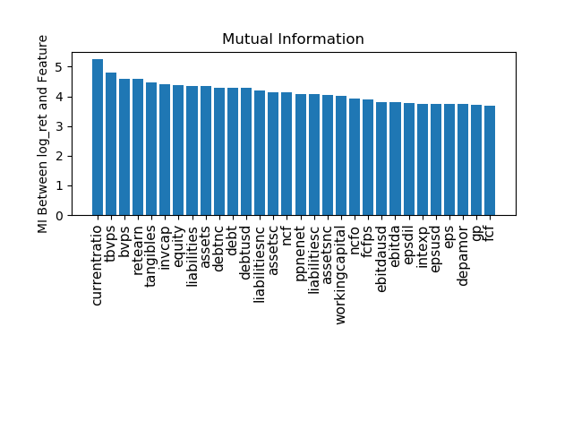

## Project Description 
In this project we select and optimize a portfolio consists of a subset of S&P 500 Index constituents. We use Mutual Information QUBO ([MIQUBO](https://cloud.dwavesys.com/leap/example-details/222058260) method for stock fundamentals' feature selection. We devise a stock scoring method for the selected features to construct the portfolio. For portfolio optimization, inspired by this [paper](https://arxiv.org/abs/2007.00017), we compare the results from D-wave's simulated annealing and Leap Hybrid Solver, for static and dynamic portfolio optimization.

Our contributions include:  

- Using a feature selection tool for assets allocation during periodical rebalancing period
- Implement feature selection using a quantum annealer
- Comparing DWave processor portfolios with hybrid and classical solvers

## Setup
pip install -r requirements.txt

## Project Details: 

#### Quantum Features selection

We use the Mutual Information QUBO method to extract relevant features from a real-world financial data set. The techniques used where borrowed from this [repository](https://github.com/dwave-examples/mutual-information-feature-selection). To calculate asset scores, first, a subset of the fundamental metrics, most relevant to price or logarithmic price return are selected using Mutual Information QUBO (MIQUBO) algorithm. Then, the score is calculated based on the selected features and their quarter over quarter trend.

Below is a comparison between the mutual information of the log-returns and other financial features. Other comparisons are found in the folder [figures](./figures/).

 | 

#### Static/Dynamic Portfolio Optimization problem

Once the QBE's portfolio is selected, it will be optimized dynamically on D-wave's LeapHybridSolver which offers a re-balancing path during the desired time frame with advantageous speed. MIQUBO scores will be updated monthly. This offers the opportunity to update the QBE's portfolio composition. The decision to update can be made based on the performance of the new portfolio versus the current using D-wave's LeapHybridSolver.

Here are results for a static portfolio optimization

 

And here are results for a dynamic portfolio optimization for 100 assets traded for 100 days. Althought the returns are negative, the DWave hybrid solver performs better than SA.

 

#### Business application

Exchange traded funds a.k.a. ETFs have become one of the most popular investment vehicles specially among retail investors, in the past decade.
A variety of financial institutions have seized this opportunity and created their own custom ETFs. Their profit is tied to the performance of the portfolio of the securities in their ETFs.
Near term quantum devices provide a chance for creating a new ETF that takes advantage of the speed of optimization in NISQ devices. This is Quantum Baked ETF (QBE). The constituents of the QBE are initially determined from a scored pool of assets generated based on the assets' fundamental data. 

MIQUBO scores can take into account value and growth investing strategies. Hence, offering two variety of QBEs, value-QBE and growth-QBE, respectively. Given our state-of-the-art optimization and feature selection, QBE will be the hot cake of the ETF market.

#### Link to Presentation
The presentation can be found [here](https://docs.google.com/presentation/d/1Q_40hvjKnNAW-a5CSStJhZfSFQr4VRwbZC-wVU2isro/edit#slide=id.ge66e857eae_0_1640).

## Contributors 

- **Behnam Javanparast** 
- **Estelle Inack**

